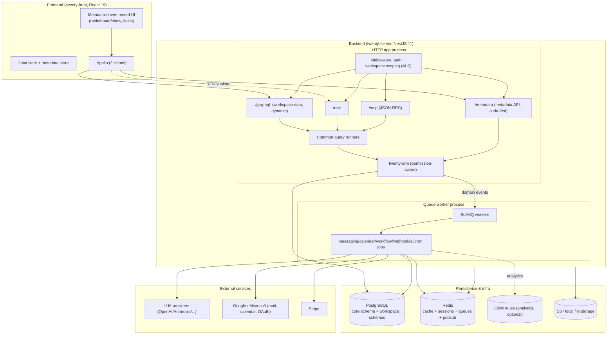
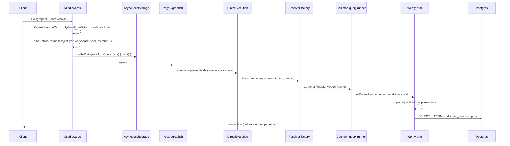
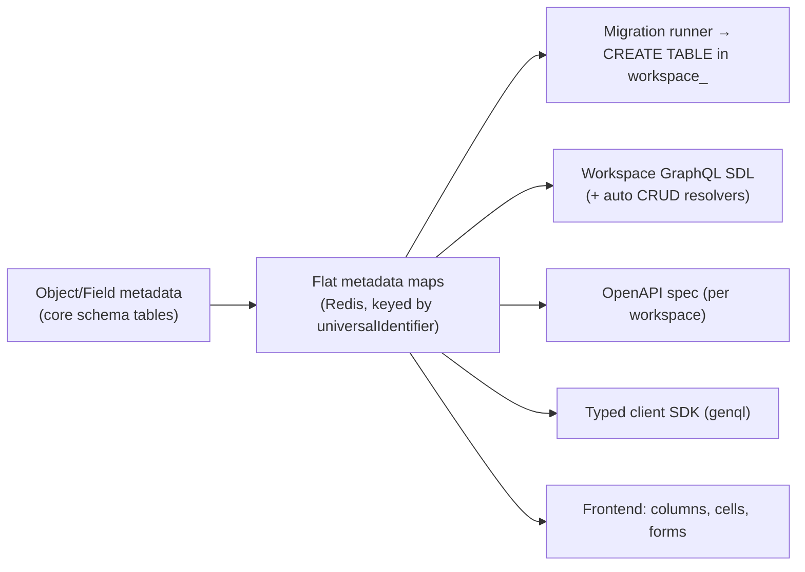

# 01 — Architecture

## Overall shape

Twenty is a **modular monolith** with a strong metadata-driven core. The server is one NestJS codebase deployed as three process roles (HTTP app, queue worker, CLI). The frontend is a React SPA that talks to two GraphQL endpoints. State that would normally be "the schema" is instead **data** (metadata) that drives code generation at runtime.

## The two GraphQL APIs

Twenty runs **two separate GraphQL Yoga servers** (see [05-API-GRAPHQL.md](05-API-GRAPHQL.md)):

- **`/graphql`** — workspace/record data. The schema is **generated at runtime from each workspace's object/field metadata** and cached (as SDL string) in Redis. CRUD resolvers (`findMany`, `createOne`, …) are auto-generated. A "direct execution" plugin bypasses graphql-js on the hot path.
- **`/metadata`** — the metadata API (create/update objects, fields, views, roles…). Conventional NestJS code-first resolvers.

REST (`/rest`) and MCP (`/mcp`) are thin adapters that funnel into the **same common query runners** as GraphQL — they are not HTTP calls into GraphQL.

## Request lifecycle (authenticated GraphQL record query)

Key point: **workspace scoping is via `AsyncLocalStorage`**, not resolver decorators. The dynamic resolvers read `workspaceId` and flat metadata maps out of ALS (`getWorkspaceAuthContext()` / `getWorkspaceContext()`). See [04-BACKEND.md](04-BACKEND.md) §§4-5.

## Metadata → everything (the generation pipeline)

Metadata mutations flow through: **side-effect expansion → diff (build) → migration runner (single transaction that writes metadata rows AND emits physical DDL) → cache invalidation + metadata version bump**. Full detail in [07-METADATA-ENGINE.md](07-METADATA-ENGINE.md).

## Event-driven async layer

Record writes emit batched domain events (`WorkspaceEventBatch`, `${object}.${action}`). The bridge listener `entity-events-to-db.listener.ts` turns those synchronous events into **async jobs**: GraphQL subscriptions, outbound webhooks (`webhookQueue`), workflow triggers (`triggerQueue`), audit logs + timeline activities (`entityEventsToDbQueue`). This is the sync→async boundary. See [15-BACKGROUND-JOBS.md](15-BACKGROUND-JOBS.md).

## Layer responsibilities (server)

| Layer | Directory | Responsibility |
|-------|-----------|----------------|
| Platform/framework | `src/engine/` | ORM, GraphQL API generation, middleware, guards, workspace-manager (migrations) |
| Infra services | `src/engine/core-modules/` (`@Global`) | auth, jwt, config, logger, cache, queue, file-storage, billing, AI, tools |
| Metadata system | `src/engine/metadata-modules/` | object/field/view/role metadata + flat-* + migration |
| Domain logic | `src/modules/` | messaging, calendar, workflow, standard objects, listeners, jobs |

## Derived vs authored

- **Authored:** the `/metadata` API resolvers, standard-object flat-metadata builders, the field-type system, workflow action executors, AI tool providers, the React UI primitives and field component dispatch.
- **Derived/generated at runtime:** per-workspace Postgres schema, per-workspace GraphQL schema + CRUD resolvers, OpenAPI, client SDK, and the record UI (columns/cells/queries).

This split is why "add a custom object" needs zero code changes but "add a new field *type*" requires modifying core (see [24-EXTENSION-VS-CORE.md](24-EXTENSION-VS-CORE.md)).
