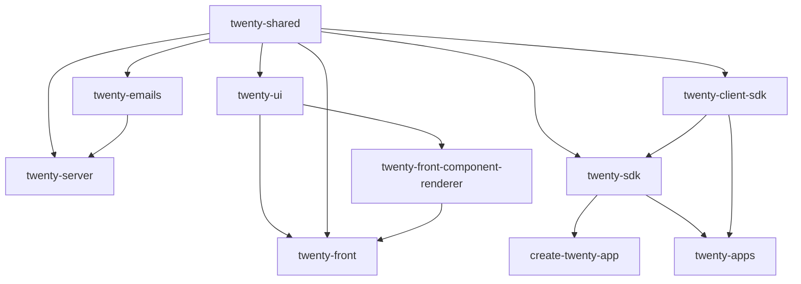

# 02 — Monorepo Structure

Nx workspace, Yarn 4 (corepack), Node `^24.5.0`. 18 packages in `package.json` `workspaces`. Root `nx.json` defines target defaults (`build`, `start`, `lint`, `lint:diff-with-main`, `typecheck`, `test`, `test:e2e`, `storybook:*`). Root `yarn start` runs server+front via `nx run-many` plus the worker after port 3000 is up.

## Package map

| Package | Path | Responsibility | Key entry points | Depends on |
|---------|------|----------------|------------------|------------|
| **twenty-server** | `packages/twenty-server` | NestJS backend: API, ORM, metadata engine, workflows, AI, jobs | `src/main.ts`, `src/app.module.ts`, `src/queue-worker/`, `src/command/` | twenty-shared, twenty-emails |
| **twenty-front** | `packages/twenty-front` | React SPA | `src/index.tsx`, `src/modules/app/components/App.tsx` | twenty-ui, twenty-shared, twenty-front-component-renderer |
| **twenty-ui** | `packages/twenty-ui` | Shared React UI library (buttons, inputs, modals, icons, theme) | subpath exports `./icon`, `./input`, `./theme`, … | twenty-shared |
| **twenty-shared** | `packages/twenty-shared` | Types/utils shared front+back (FieldMetadataType, composite types, PermissionFlagType, application manifest types, i18n) | `src/index.ts` + subpaths | (none) |
| **twenty-emails** | `packages/twenty-emails` | React Email templates | — | twenty-shared |
| **twenty-sdk** | `packages/twenty-sdk` | **App developer SDK + the working CLI** (`bin twenty`) | `src/sdk/define`, `src/cli/cli.ts`, `src/sdk/logic-function`, `src/front-component-renderer` | twenty-shared, twenty-client-sdk |
| **twenty-client-sdk** | `packages/twenty-client-sdk` | Typed API client (core/metadata/rest) + genql codegen | `src/core`, `src/metadata`, `src/rest`, `src/generate` | twenty-shared |
| **create-twenty-app** | `packages/create-twenty-app` | Scaffolder (`npx create-twenty-app`) | `src/create-app.command.ts`, template in `src/constants/template/` | twenty-sdk |
| **twenty-front-component-renderer** | `packages/twenty-front-component-renderer` | Sandboxed rendering of app "front components" (Remote DOM + iframe + worker) | `src/host/components/FrontComponentRenderer.tsx` | twenty-ui |
| **twenty-apps** | `packages/twenty-apps` | Example/public/internal/fixture apps | `examples/hello-world`, `public/slack`, … | twenty-sdk, twenty-client-sdk |
| **twenty-zapier** | `packages/twenty-zapier` | Zapier integration app | `src/index.ts` | (external API) |
| **twenty-docker** | `packages/twenty-docker` | Dockerfiles, compose, Helm, k8s | `twenty/Dockerfile`, `docker-compose.yml`, `helm/`, `k8s/` | — |
| **twenty-e2e-testing** | `packages/twenty-e2e-testing` | Playwright E2E | `playwright.config.ts`, `tests/` | — |
| **twenty-website** | `packages/twenty-website` | Next.js marketing site | — | — |
| **twenty-docs** | `packages/twenty-docs` | Mintlify docs site | — | — |
| **twenty-utils** | `packages/twenty-utils` | Dev scripts | `setup-dev-env.sh` | — |
| **twenty-oxlint-rules** | `packages/twenty-oxlint-rules` | Custom oxlint plugin (twenty/* rules) | `oxlint-plugin.ts`, `rules/` | — |
| **twenty-codex-plugin** | `packages/twenty-codex-plugin` | Codex plugin for building Twenty apps; also holds concept docs (`references/concepts/how-apps-work.md`) | — | — |
| **twenty-claude-skills** | `packages/twenty-claude-skills` | Claude skills for Twenty | — | — |
| ~~twenty-cli~~ | `packages/twenty-cli` | **DEPRECATED** tombstone (`deprecate.js` prints "use twenty-sdk") | — | — |

## Dependency relationships

## Architectural core vs supporting

- **Core (must understand to work on the platform):** `twenty-server`, `twenty-front`, `twenty-shared`, `twenty-ui`.
- **Extension surface (understand to build/ship apps):** `twenty-sdk`, `twenty-client-sdk`, `create-twenty-app`, `twenty-front-component-renderer`, `twenty-apps`.
- **Supporting/optional:** `twenty-emails`, `twenty-zapier`, `twenty-docker`, `twenty-e2e-testing`, `twenty-website`, `twenty-docs`, `twenty-utils`, `twenty-oxlint-rules`, `twenty-codex-plugin`, `twenty-claude-skills`.

## Build ordering

`twenty-shared` builds first (many packages depend on it); Nx enforces `dependsOn: ["^build"]` on `build`/`start`/`lint`/`typecheck`. See [19-DEVELOPMENT-WORKFLOW.md](19-DEVELOPMENT-WORKFLOW.md).
