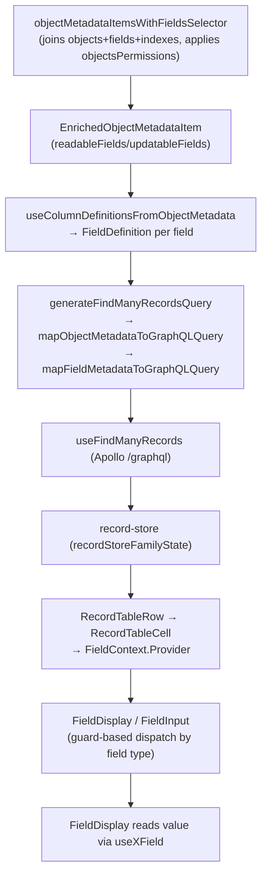

# 03 — Frontend Architecture

Package `packages/twenty-front` (React 19) + `packages/twenty-ui`. All paths under `packages/`. Two shifts from older docs: **state is Jotai** (Recoil removed; a Recoil-shaped wrapper sits on top of Jotai), and **twenty-ui styling migrated off Linaria to CSS Modules + SCSS with CSS-variable themes** (twenty-front still uses Linaria).

## 1. Bootstrap

- **Entry** `twenty-front/src/index.tsx`: loads fonts + `twenty-ui/style.css`, `theme-light.css`, `theme-dark.css`; `migrateTokenPairCookieToLocalStorage()`; then `hydrateMetadataStore().then(renderApp, renderApp)` — the flat metadata store hydrates from IndexedDB/localStorage **before** React mounts; then `createRoot(...).render(<App/>)`.
- **`App`** `src/modules/app/components/App.tsx`: `initialI18nActivate()`, then provider shell: `JotaiProvider store={jotaiStore}` → `AppErrorBoundary` → `I18nActivationGate` → `I18nProvider` → `SnackBarComponentInstanceContext` → `IconsProvider` → `ExceptionHandlerProvider` → `HelmetProvider` → `ClickOutsideListenerContext` → `DomainShell`.
- **`DomainShell.tsx`** decides routing on `clientConfigApiStatusState`: `!isMultiWorkspaceEnabled` → `WorkspaceApp`; else `isDefaultDomain ? RootApp : WorkspaceApp`. Each mounts a `RouterProvider`.
- **Provider tiers:** `SharedAppProviders` (always: metadata Apollo + theme + client-config) → `WorkspaceAppProviders` (authenticated app: metadata load effects, `UserContextProvider`, `AuthProvider`, `ApolloCoreProvider` for `/graphql`, `SSEProvider`, `SnackBarProvider`, `AgentChatProvider`, `DialogManager`, then `<Outlet/>` + `MainContextStoreProvider`, `CommandRunner`).
- **Client config** `src/modules/client-config/`: `useClientConfig().fetchClientConfig()` fans one response into ~40 Jotai atoms (`isMultiWorkspaceEnabledState`, `billingState`, `authProvidersState`, `aiModelsState`, `labPublicFeatureFlagsState`, …). Server base URL: `window._env_?.REACT_APP_SERVER_BASE_URL || window.location.origin` (`src/config/index.ts`).

## 2. Routing (react-router v6 data router)

`app/hooks/useCreateWorkspaceAppRouter.tsx` builds `createBrowserRouter(createRoutesFromElements(...))`. All pages are `React.lazy` under a single root `<Route element={<WorkspaceAppProviders/>}>`. Paths come from the `AppPath` enum (`twenty-shared/types`).

Layout nesting (`ui/layout/page/components/`): `MinimalMetadataGate` → `DefaultLayout` → `MainAppLayoutWithSidePanel` wraps `RecordIndexPage`, `RecordShowPage`, `AiChatPage`, `SettingsRoutes`, etc. `AuthFlowLayout` and `BlankLayout` (onboarding) are the other trees. `DefaultLayout` is the chrome (nav drawer, keyboard-shortcut menu, banners); `MainAppLayoutWithSidePanel` animates the app↔settings transition (framer-motion) and mounts the side panel.

## 3. Apollo (two clients, two endpoints)

Both built by `ApolloFactory` (`apollo/services/apollo.factory.ts`, ~477 lines):
- **Metadata client** → `/metadata` (`apollo/components/ApolloProvider.tsx`). Schema/metadata, auth, users, views, settings.
- **Core client** → `/graphql` (`object-metadata/components/ApolloCoreProvider.tsx`, consumed via `useApolloCoreClient()`). All object-record CRUD.

Link chain: `errorLink → authLink → retryLink → streamingRestLink → restLink → uploadLink`. `authLink` attaches `Bearer` from `getTokenPair()` + `x-locale` + `X-App-Version` (skips token under cookie-auth). `errorLink` handles `UNAUTHENTICATED` (shared de-duplicated `renewToken`), `APP_VERSION_MISMATCH`, 413. Cache: `InMemoryCache`, default `watchQuery` policy `cache-and-network`.

**Codegen** → three files: `src/generated/graphql.ts` (`/graphql` core ops), `src/generated-metadata/graphql.ts` (`/metadata`, ~9700 lines: `User`, `Object`, `Field`, enums like `FieldMetadataType`, `PermissionFlagType`), `src/generated-admin/graphql.ts`. Run `npx nx run twenty-front:graphql:generate [--configuration=metadata|admin]`.

## 4. Metadata store (offline-first)

`src/modules/metadata-store/`: caches all metadata locally, syncs via SSE. `states/metadataStoreState.ts` is an atom family keyed by `MetadataEntityKey` (`objectMetadataItems`, `fieldMetadataItems`, `views`, `viewFields`, `pageLayouts`, `roles`, `commandMenuItems`, …), each `{current, draft, status, currentCollectionHash}`, persisted through IndexedDB. `useLoadMinimalMetadata` compares server `collectionHashes` to local hashes to detect stale entities. Types are the `Flat*` family.

## 5. State management (Jotai + Recoil-shaped wrapper)

- **Store** `ui/utilities/state/jotai/jotaiStore.ts`: one module-level `createStore()`; `resetJotaiStore()` on sign-out.
- **Tagged-state wrapper**: every state is a discriminated object (`State`, `Selector`, `WritableSelector`, `FamilyState`, `ComponentState`, `ComponentFamilyState`, `ComponentSelector`).
- **Creators** (`jotai/utils/`): `createAtomState` (plain/atomWithStorage for local/session/cookie), `createAtomFamilyState` (keyed cache), `createAtomComponentState` (**component-instance-scoped** via `componentInstanceContext` + per-instanceId atom cache), `createAtomSelector` + family/component/writable variants. `buildGetHelper` gives selectors a polymorphic `get(state, key?)`.
- **Component-instance context** (`ui/utilities/state/component-state/`): `ComponentStateKey = {instanceId}`; `useAvailableComponentInstanceIdOrThrow` resolves instanceId with priority **explicit prop > nearest Provider > throw**. This isolates identical state per instance (two tables, side-panel vs main).
- **Record store**: `object-record/record-store/states/recordStoreFamilyState` keyed by recordId; `recordStoreFamilySelector` reads/writes individual field values. Field components read here; `usePersistField`/`useUpdateOneRecord` write here.
- **context-store** (`src/modules/context-store/`): coordinates "which object/view/records are targeted" across index/show/command-menu/side-panel, component-scoped. Key atoms: `contextStoreCurrentObjectMetadataItemIdComponentState`, `contextStoreCurrentViewIdComponentState`, `contextStoreTargetedRecordsRuleComponentState` (selection/exclusion union for select-all). `MainContextStoreProvider` resolves the effective viewId (URL `?viewId` > last-visited > index view > first).

## 6. twenty-ui primitives

ESM-first, granular subpath exports (`./icon`, `./input`, `./data-display`, `./feedback`, `./layout`, `./surfaces`, `./navigation`, `./typography`, `./theme`, `./theme-constants`, `./utilities`, `./style.css`, `./theme-light.css`, `./theme-dark.css`). Concrete primitives:
- Buttons: `Button` (variants primary/secondary/tertiary × accents), `IconButton`, `FloatingButton`, `ButtonGroup`.
- Inputs: `Toggle`, `Checkbox`, `Radio`, `Slider`, `SearchInput`, `SegmentedControl`, `CodeEditor`. (Generic `TextInput`/`Select` are NOT in twenty-ui — text inputs live in twenty-front; selects composed from `MenuItemSelect*`.)
- Data-display: `Tag`, `Chip`, `Pill`, `Status`, `Avatar`. Feedback: `Banner`, `Callout`, `Loader`, `ProgressBar`. Surfaces: `Card`, `Modal`, `AppTooltip`. Typography: `H1Title`…, `Label`.
- Icons: `IconComponent` type; curated Tabler allow-list; `IconsProvider` lazy-loads; `useIcons().getIcon(name)` resolves string keys (metadata stores icon names as strings).

Styling: **twenty-ui** uses CSS Modules + SCSS (`.module.scss`) with `data-*` attributes + CSS custom-property fallbacks (low specificity so front overrides win). **twenty-front** uses Linaria `styled` consuming `themeCssVariables` from `twenty-ui/theme-constants`.

## 7. Metadata-driven UI (the central flow)

The entire record UI is generated from `objectMetadataItems`. End-to-end:

Notable details:
- **Enrichment** `object-metadata/states/objectMetadataItemsWithFieldsSelector.ts` applies `currentUserWorkspace.objectsPermissions` → `readableFields`/`updatableFields`.
- **Dynamic query** `mapObjectMetadataToGraphQLQuery` iterates readable fields, enforces per-object read permission (returns `''` for non-readable nested objects), expands composite types literally (LINKS→`primaryLinkUrl/...`, CURRENCY→`amountMicros/currencyCode`, FULL_NAME, ADDRESS, ACTOR, EMAILS, PHONES, FILES, RICH_TEXT→`blocknote/markdown`), recurses into relations.
- **Per-cell context** `FieldContext` (`record-field/ui/contexts/FieldContext.ts`) is the single object every field component reads (`fieldDefinition`, `recordId`, read-only flags, `useUpdateRecord`).
- **Type dispatch** `FieldDisplay.tsx` / `FieldInput.tsx` are **guard-based ternary chains** (not a `Record<type, component>` map) using guards like `isFieldText`, `isFieldRelationManyToOne`, dispatching to `meta-types/{display,input}/components/`.
- **Write-back** input submit → `usePersistField` → `useUpdateOneRecord` → `generateUpdateOneRecordMutation` + optimistic cache effects.

## 8. Pages & record views

- **Index** `pages/object-record/RecordIndexPage.tsx` → `RecordIndexContainerGater` (provisions `RecordIndexContext` + view/record contexts, gates on `canReadObjectRecords`) → `RecordIndexContainer` switches on `recordIndexViewTypeState`: `TABLE` → `RecordTableWithWrappers`, `KANBAN` → `RecordBoardContainer` (dnd-kit), `CALENDAR`, `LIST`.
- **Show** `pages/object-record/RecordShowPage.tsx`: the detail body is **page-layout/widget/tab driven** (`modules/page-layout/`, `PageLayoutRenderer`), not hardcoded. Inline fields → `RecordInlineCell` → `FieldDisplay`/`FieldInput`.

## 9. Command menu, hotkeys, views, navigation, settings

- **Command menu (cmd+K)** refactored into the **side-panel** module. `useCommandMenuHotKeys` binds `meta+k`, `/` (search), `@` (Ask AI). `SidePanelRouter` renders pages from `SIDE_PANEL_PAGES_CONFIG` with a back-stack. Commands are **server-driven metadata** (`commandMenuItemsSelector` reads `metadataStoreState.commandMenuItems`).
- **Hotkeys** use `react-hotkeys-hook` wrapped by `ui/utilities/hotkey/hooks/` (`useGlobalHotkeys`, `useHotkeysOnFocusedElement`). Old scoped-hotkey API replaced by a **focus stack** (`focusStackState`), scoping by `focusId`.
- **Views** (`src/modules/views/`): `ViewBar` + Effect components copy the persisted view (`viewFields`/`viewFilters`/`viewSorts`) into component-scoped `currentRecord*ComponentState` that the table/query layer reads. Save hooks diff current-record state vs the view.
- **Navigation** (`src/modules/navigation/`): `AppNavigationDrawer` switches Main vs Settings drawer; workspace objects rendered from `navigation-menu-item/`.
- **Settings** (`app/components/SettingsRoutes.tsx`, ~1121 lines): nested lazy `<Routes>`, permission-gated by grouping under `<SettingsProtectedRouteWrapper settingsPermission={PermissionFlagType.X}/>`. Sidebar from `useSettingsNavigationItems`.

## 10. Auth & permissions in UI

Auth atoms (`auth/states/`, localStorage-backed): `currentUserState`, `currentWorkspaceState`, `currentWorkspaceMemberState`, `currentUserWorkspaceState` (**permissions source**: `permissionFlags`, `objectsPermissions`, `isImpersonating`), `tokenPairState`. `useAuth.ts` drives sign-in/out. Two permission tiers, both from `currentUserWorkspaceState`: workspace flags via `useHasPermissionFlag(PermissionFlagType)`; object CRUD via `useObjectPermissions` → `objectPermissionsByObjectMetadataId`. Object permissions feed query generation, field enrichment, and UI gating.

## 11. Localization & theming

- **Lingui**: `initialI18nActivate()` detects locale (URL `?locale` > localStorage > navigator), `dynamicActivate` code-splits catalogs (`src/locales/generated/${locale}.ts`), 36 locales. Usage: `useLingui()` + `msg`/`t` macros.
- **Theming**: twenty-ui `theme-constants` is source of truth; `theme-light.css`/`theme-dark.css` define `--t-*` vars under `.light`/`.dark` on `<html>`; `themeCssVariables` is the JS mirror. `BaseThemeProvider` bridges color scheme; `UserThemeProviderEffect` syncs the member's saved scheme.

## 12. Implementing a new frontend feature

Folder-per-domain under `src/modules/<domain>/` (`components/`, `hooks/`, `states/`, `graphql/{queries,mutations,fragments}/`, `types/`, `utils/`, `effect-components/`, `states/contexts/`). Pages in `src/pages/<domain>/`, lazy-loaded; permission-gated settings via `SettingsProtectedRouteWrapper`. State: `createAtomState`/`createAtomSelector` (global) or `createAtomComponentState` (instance-scoped). For record data reuse `useFindManyRecords`/`useUpdateOneRecord`/`usePersistField` — never hand-write record GraphQL. Compose twenty-ui primitives, style with Linaria + `themeCssVariables`, Lingui macros for strings, icons via `useIcons`.

**Anchor files:** `app/components/{App,DomainShell,WorkspaceAppProviders}.tsx`, `app/hooks/useCreateWorkspaceAppRouter.tsx`, `apollo/services/apollo.factory.ts`, `object-metadata/states/objectMetadataItemsWithFieldsSelector.ts`, `object-metadata/utils/mapObjectMetadataToGraphQLQuery.ts`, `object-record/hooks/useFindManyRecords.ts`, `object-record/record-field/ui/components/FieldDisplay.tsx`, `ui/utilities/state/jotai/utils/createAtomComponentState.ts`, `auth/hooks/useAuth.ts`.
