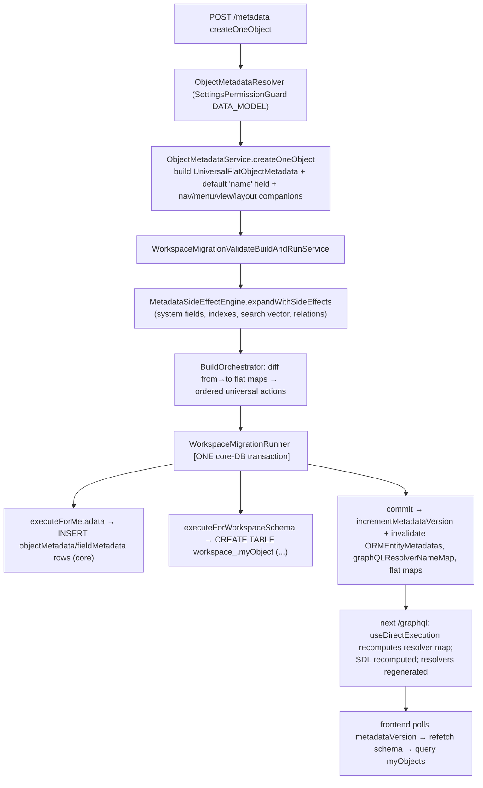

# 07 — Metadata Engine

The metadata engine is the architectural heart of Twenty. Paths under `packages/twenty-server/src/engine/`. The classic TypeORM entity/service layer is now a **thin persistence shell**; all mutations flow through immutable **flat metadata → unified workspace migration → side-effect expansion → physical DDL**.

## 1. object-metadata & field-metadata

- **`ObjectMetadataEntity`** (`metadata-modules/object-metadata/object-metadata.entity.ts`, `@Entity('objectMetadata')`, extends `SyncableEntity`): `nameSingular`/`namePlural`, labels, `isCustom`/`isSystem`/`isActive`/`isSearchable`, `isUIEditable`, `overrides` (jsonb), `labelIdentifierFieldMetadataId`. Unique `(nameSingular, workspaceId)` & `(namePlural, workspaceId)`. `@OneToMany` → fields, indexes, search fields, permissions, views. `createOneObject`/`updateOneObject`/`deleteOneObject` in `object-metadata.service.ts` **return `FlatObjectMetadata`, not entities.**
- **`FieldMetadataEntity<T extends FieldMetadataType>`** (`field-metadata/field-metadata.entity.ts`): `type`, `name`, `label`, `defaultValue`/`options`/`settings`/`overrides` (jsonb), `isNullable`/`isSystem`/`isActive`, relation columns `relationTargetFieldMetadataId` (self `@OneToOne`), `relationTargetObjectMetadataId` (`@ManyToOne`), `morphId` (with `@Check`). `isUnique` is **derived** at flat-cache build time from a backing single-field unique index.

## 2. Field type system

`FieldMetadataType` enum in **twenty-shared** (`packages/twenty-shared/src/types/FieldMetadataType.ts`): 25 types — UUID, TEXT, NUMBER, NUMERIC, BOOLEAN, DATE, DATE_TIME, SELECT, MULTI_SELECT, RATING, POSITION, ARRAY, RAW_JSON, TS_VECTOR, FILES, RELATION, MORPH_RELATION + 8 composites.

**Composite types** (`twenty-shared/src/types/composite-types/`, registry `composite-type-definitions.ts`): LINKS, CURRENCY, FULL_NAME, ADDRESS, ACTOR, EMAILS, PHONES, RICH_TEXT. Each has `properties: CompositeProperty[]` (e.g. FULL_NAME → firstName, lastName both TEXT). **Column expansion** in `twenty-orm/factories/entity-schema-column.factory.ts` (`createCompositeColumns` → `computeCompositeColumnName`).

**Relations are not a separate entity** — modeled on `FieldMetadataEntity` as a **pair of mutually-referencing rows** (`type = RELATION|MORPH_RELATION`, `relationTargetObjectMetadataId` + `relationTargetFieldMetadataId`); `MORPH_RELATION` groups several via `morphId`. Cardinality/join in `settings` jsonb. **Indexes**: `IndexMetadataEntity` + `IndexFieldMetadataEntity` (`index-metadata/`).

## 3. The flat-* modules — what "flat" is

**Flat metadata = an immutable, plain-serializable, in-memory snapshot** of a metadata entity where nested relation graphs are flattened into arrays of `universalIdentifier` strings and dates are strings. Purpose: Redis-cacheable + amenable to pure-function **diff / validate / migrate** without touching the DB. ~30 flat modules exist (flat-object-metadata, flat-field-metadata, flat-index-metadata, flat-view, flat-role, flat-agent, flat-webhook, …).

- Generic transform `flat-entity/types/flat-entity-from.type.ts` (`FlatEntityFrom`) replaces relation objects with `...UniversalIdentifiers` arrays.
- **`flatEntityMaps` pattern** (`flat-entity/types/flat-entity-maps.type.ts`): `FlatEntityMaps<T> = {byUniversalIdentifier} & {universalIdentifierById, universalIdentifiersByApplicationId}` — dictionaries keyed by `universalIdentifier` with secondary id/app indexes, O(1) lookups.
- **Build/cache**: `flat-entity/services/workspace-many-or-all-flat-entity-maps-cache.service.ts` — lazy read-through over `WorkspaceCacheService`; per-kind builders convert entities via `from-*-entity-to-flat-*` utils.

## 4. metadata-side-effect — how changes propagate

When metadata changes, the side-effect engine **expands the operation matrix with companion changes** before validation.

- Engine `metadata-side-effect/services/metadata-side-effect-engine.service.ts` — `expandWithSideEffects` clones the op matrix, runs registered handlers per `(operation, metadataName)`, merges (dedup by `universalIdentifier`, collision detection).
- Registry `metadata-side-effect/registry/metadata-side-effect-handler-registry.service.ts` auto-discovers handlers via `DiscoveryService`.
- Handlers (`metadata-side-effect/handlers/`): object create → system fields + INDEX view + system relations + search vector; field create → unique backing index + index view field; deletes → cascade companion cleanup.
- Invoked from `WorkspaceMigrationValidateBuildAndRunService.expandWithSideEffects`; the legacy path bypasses it.

## 5. workspace-metadata-version & cache invalidation

- `workspace-metadata-version/services/workspace-metadata-version.service.ts` — `incrementMetadataVersion` writes `workspace.metadataVersion + 1`, mirrors into `WorkspaceCacheStorageService.setMetadataVersion`, invalidates the `workspaceEntity` cache. Clients poll this version to detect schema changes.
- **Bump is triggered by the migration runner, not resolvers.** After a migration commits, `WorkspaceMigrationRunnerService` computes `shouldIncrementMetadataGraphqlSchemaVersion = flatMapsKeys ∋ flatObjectMetadataMaps|flatFieldMetadataMaps`; if true → `incrementMetadataVersion` + `workspaceCacheService.invalidateAndRecompute(workspaceId, ['ORMEntityMetadatas','graphQLResolverNameMap'])` — regenerating the dynamic GraphQL schema and TypeORM entity metadata.

## 6. Metadata → physical DDL (the migration pipeline)

The v2 **flat-entity + universal-migration-action** pipeline. There is **no persisted `WorkspaceMigrationEntity`/column-action table driving execution** — actions are computed on the fly by diffing before/after flat maps and executed immediately in one transaction.

**Orchestration** `workspace-manager/workspace-migration/services/workspace-migration-validate-build-and-run-service.ts`:
1. Load current flat maps, `MetadataSideEffectEngineService.expandWithSideEffects`.
2. Compute from→to snapshots, `WorkspaceMigrationBuildOrchestratorService.buildWorkspaceMigration` diffs into ordered `UniversalCreateObjectAction`/`UniversalCreateFieldAction`/`UniversalUpdateFieldAction`… (keys via `buildActionHandlerKey(actionType, metadataName)`, e.g. `create:objectMetadata`).
3. Preallocate UUIDs, `WorkspaceMigrationRunnerService.run`.

**Runner (single core-DB transaction)** `workspace-migration/workspace-migration-runner/services/workspace-migration-runner.service.ts`: guarded by `WORKSPACE_SCHEMA_DDL_LOCKED`; one `QueryRunner`, `startTransaction`, `SET LOCAL lock_timeout='8s'`; iterates actions via `WorkspaceMigrationRunnerActionHandlerRegistryService` (DiscoveryService), merging each action's optimistic cache; commit → invalidate caches + bump metadata version. **Metadata-table writes and physical DDL run on the same transaction — atomic.**

**Two-sided handler contract** — each `Create/Update/Delete{Object,Field}ActionHandlerService` (`.../action-handlers/`) has:
- `executeForMetadata` → writes core metadata tables.
- `executeForWorkspaceSchema` → emits physical DDL via `WorkspaceSchemaManagerService`.

e.g. `create-object-action-handler.service.ts` builds column definitions, creates enum types for SELECT/MULTI_SELECT/RATING, then `tableManager.createTable(...)`. Field creation → `columnManager.addColumns` + `foreignKeyManager.createForeignKey` for MANY_TO_ONE. Type mapping `field-metadata-type-to-column-type.util.ts` (UUID→uuid, NUMERIC→numeric, DATE_TIME→timestamptz, SELECT→enum, FILES/RAW_JSON→jsonb, TS_VECTOR→tsvector).

## 7. Full lifecycle: custom object → queryable

## 8. Mental model

**Metadata (flat maps) is the hub.** The migration runner writes both metadata rows and physical DDL atomically. The query side reads flat maps to synthesize schema + resolvers on demand. REST/MCP/GraphQL/OpenAPI/SDK all read the same flat maps. This is why custom objects/fields need zero code, but new field *types* / new composite types require core changes.

**Anchor files:** `metadata-modules/object-metadata/object-metadata.service.ts`, `metadata-modules/field-metadata/field-metadata.entity.ts`, `metadata-modules/flat-entity/`, `metadata-modules/metadata-side-effect/`, `metadata-modules/workspace-metadata-version/`, `workspace-manager/workspace-migration/services/workspace-migration-validate-build-and-run-service.ts`, `.../workspace-migration-runner/`, `twenty-shared/src/types/FieldMetadataType.ts` + `composite-types/`.
