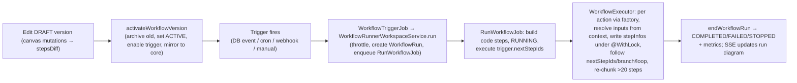

# 08 — Workflows / Automation Engine

Backend: `packages/twenty-server/src/modules/workflow/` (subdirs `workflow-builder`, `workflow-executor`, `workflow-runner`, `workflow-trigger`, `workflow-tools`, `workflow-status`, `workflow-core-sync`, `common`) + `engine/core-modules/workflow/`. Frontend editor: `packages/twenty-front/src/modules/workflow/`.

## 1. Data model (workspace entities)

`modules/workflow/common/standard-objects/`:
- **`WorkflowWorkspaceEntity`** — `name`, `lastPublishedVersionId`, `coreWorkflowId`, `statuses: WorkflowStatus[]` (DRAFT | ACTIVE | DEACTIVATED — a workflow can have both a draft and an active version), relations `versions[]`, `runs[]`, `automatedTriggers[]`.
- **`WorkflowVersionWorkspaceEntity`** — the flow snapshot. `trigger: WorkflowTrigger | null` (single trigger JSON), `steps: WorkflowAction[] | null` (JSON array; graph via `nextStepIds`), `status: DRAFT | ACTIVE | DEACTIVATED | ARCHIVED`. Editing happens only on DRAFT; activation flips to ACTIVE and archives the previous published version. **At most one ACTIVE version per workflow** (transactional check).
- **`WorkflowRunWorkspaceEntity`** — one execution. `status: NOT_STARTED | ENQUEUED | RUNNING | COMPLETED | FAILED | STOPPING | STOPPED`. `state: WorkflowRunState = {flow:{trigger,steps}, stepInfos, workflowRunError?}` (the authoritative execution state, per-step status/result/error keyed by step id + "trigger"). `stepLogs` (detailed code/http logs, capped 256KB/step via `jsonb_set`).
- **`WorkflowAutomatedTriggerWorkspaceEntity`** — installed automated-trigger registry (`type: DATABASE_EVENT | CRON`, `settings`, `workflowId`). Rows created/deleted on activation. MANUAL/WEBHOOK create no row.

Shared enums (`twenty-shared/src/workflow/`): `WorkflowActionType` (CODE, LOGIC_FUNCTION, SEND_EMAIL, DRAFT_EMAIL, CREATE_CALENDAR_EVENT, CREATE/UPDATE/DELETE/UPSERT_RECORD, FIND_RECORDS, PICK_RECORD, FORM, FILTER, IF_ELSE, HTTP_REQUEST, AI_AGENT, ITERATOR, EMPTY, DELAY), `StepStatus` (NOT_STARTED, RUNNING, SUCCESS, STOPPED, FAILED, FAILED_SAFELY, PENDING, SKIPPED).

## 2. Triggers (`workflow-trigger/`)

`WorkflowTriggerType`: DATABASE_EVENT | MANUAL | CRON | WEBHOOK.

**Activation** (`workflow-trigger.workspace-service.ts::activateWorkflowVersion`): validate → build code steps → transaction (archive old version, set `lastPublishedVersionId`, mark ACTIVE, `enableAutomatedTrigger`):
- DATABASE_EVENT → insert automated-trigger row (settings: `eventName`, watched `fields`, record `filter`).
- CRON → `computeCronPatternFromSchedule`, insert row + write Redis hash `WORKFLOW_CRON_TRIGGER_CACHE_KEY`.
- MANUAL → creates a command-menu item (GLOBAL / RECORD_SELECTION). WEBHOOK → no row.

**DATABASE_EVENT firing** — `automated-trigger/listeners/workflow-database-event-trigger.listener.ts` subscribes `@OnDatabaseBatchEvent('*', ...)` for CREATED/UPDATED/DELETED/DESTROYED/UPSERTED: enrich records with relations → resolve matching listeners (from core trigger-map cache when `IS_WORKFLOW_DISPATCH_FROM_CORE_ENABLED`, else query `workflowAutomatedTrigger` by `eventName`) → `shouldTriggerJob` = watched-field change AND record-filter match (`evaluateStepFilters`) → enqueue `WorkflowTriggerJob` on `workflowQueue` (retryLimit 3).

**CRON** — `automated-trigger/crons/jobs/workflow-cron-trigger-cron.job.ts` runs every minute on `cronQueue`, reads the Redis cron hash (falls back to DB scan), `CronTriggerDeduplicationService.shouldDispatch`, enqueues `WorkflowTriggerJob`.

**WEBHOOK/route** — `engine/core-modules/workflow/controllers/workflow-trigger.controller.ts`: public `GET|POST /webhooks/workflows/:workspaceId/:workflowId` (`PublicEndpointGuard`), body = trigger payload. **MANUAL** — GraphQL `runWorkflowVersion`.

**Dispatch job** `workflow-trigger/jobs/workflow-trigger.job.ts`: loads workflow, verifies ACTIVE published version, calls `WorkflowRunnerWorkspaceService.run(...)`.

## 3. Actions / steps (`workflow-executor/`)

Interface `interfaces/workflow-action.interface.ts` — `WorkflowAction { execute(input): Promise<WorkflowActionOutput> }`. Input `{currentStepId, steps, context, runInfo}`; `context = getWorkflowRunContext(stepInfos)` (map of successful step outputs); each action resolves templated inputs via `resolveInput(step.settings.input, context)`. Output `{result?, error?, pendingEvent?, shouldEndWorkflowRun?, shouldRemainRunning?, shouldSkipStepExecution?, shouldFailSafely?}`. Factory `factories/workflow-action.factory.ts` — `WorkflowActionFactory.get(type)`.

Per-action (`workflow-executor/workflow-actions/`): record-crud (`create/update/delete/upsert/find-records/pick-record`), mail-sender (`send-email`/`draft-email`), `code` (via `LogicFunctionExecutorService`, persists step log), `logic-function`, `ai-agent`, `http-request` (extends `tool-backed.workflow-action.ts` using `HttpTool`), `create-calendar-event`, `form`, `filter`, `if-else`, `iterator`, `delay`, `empty`.

Control-flow: **if-else** chooses branch (`nextStepIdsToExecute` + skip the other); **iterator** (`MAX_ITERATIONS=10000`) tracks `currentItemIndex`, resets loop-body step infos each iteration, supports continue-on-failure; **form** returns `{pendingEvent:true}` → run pauses.

## 4. Execution engine (`workflow-runner/` + `workflow-executor/`)

**Entry** `WorkflowRunnerWorkspaceService.run()`: check billing + hard throttle (`WorkflowThrottlingWorkspaceService`); manual → `enqueueWorkflowRun` (ENQUEUED + `RunWorkflowJob`); non-manual → `createNotStartedWorkflowRunAndTriggerEnqueueJob` (NOT_STARTED + `WorkflowRunEnqueueJob`). Run creation seeds `state` via `getInitState()`.

**Worker job** `jobs/run-workflow.job.ts` (`RunWorkflowJob`, `workflowQueue`, `Scope.REQUEST`): runs inside `globalWorkspaceOrmManager.executeInWorkspaceContext(..., buildSystemAuthContext(workspaceId))`. Dispatches:
- **start** → build code steps, `startWorkflowRun()` (RUNNING, trigger SUCCESS), `executeFromSteps({stepIds: trigger.nextStepIds})`.
- **resume** (after form/delay) → recompute next steps from last output.
- **retry** → re-execute given step ids.
Thrown error → `endWorkflowRun(FAILED, isSystemError:true)`.

**Step execution** `WorkflowExecutorWorkspaceService`: `executeFromSteps` runs step ids **in parallel** (`Promise.all`); per step `executeStep` → `factory.get(type).execute(...)` → `processStepExecutionResult` maps output to a `StepStatus` written into `stepInfos[stepId]` → emits usage/billing event (100 micro-credits) → `getNextStepIdsToExecute` (iterator/if-else aware). **Re-chunking**: after `MAX_EXECUTED_STEPS_COUNT=20` steps, `continueExecutionFromStepInAnotherJob()` re-enqueues. Status resolution `computeWorkflowRunStatus`.

**State passing**: no in-memory state between steps — `workflowRun.state` JSON is the single source of truth, reloaded and patched per step, all writes under `@WithLock('workflowRunId')` distributed lock. Downstream reads via `getWorkflowRunContext(stepInfos)`.

**Pause/resume**: FORM returns `pendingEvent` → step PENDING, run RUNNING. UI submit → `submitFormStep()` writes SUCCESS + `resume()`. DELAY similar.

## 5. Queues & throttling

Jobs on `workflowQueue` (except cron dispatchers on `cronQueue`): `WorkflowTriggerJob`, `RunWorkflowJob` (`id: workflowRunId` for idempotent dedup), `WorkflowRunEnqueueJob` (throttled promotion NOT_STARTED → ENQUEUED), plus cron maintenance (`WorkflowRunEnqueueCronJob`, `WorkflowHandleStaledRunsCronJob`, `WorkflowCleanWorkflowRunsCronJob`). `WorkflowThrottlingWorkspaceService` keeps Redis counters and enforces soft/hard workspace limits.

## 6. Retries, errors, history

Trigger jobs retry 3×. Run-level `retryWorkflowRun()` (only from FAILED) resets failed steps and enqueues `RunWorkflowJob` with `stepIdsToRetry`. Error surfaces: FAILED (hard) vs FAILED_SAFELY (swallowed, e.g. continue-on-failure iterator) vs system error (Sentry + metric). Staled recovery via `workflow-run-queue` (`staled-runs`, `stuck-running-runs`). **History = the `WorkflowRun` records** (`state.stepInfos` + `stepLogs`) + metrics counters. `workflow-status/` recomputes the parent `workflow.statuses[]` aggregate.

## 7. Frontend editor

`@xyflow/react` (React Flow). Canvas `workflow-diagram/components/WorkflowDiagramCanvasBase.tsx` (editable/readonly/run variants). `generateWorkflowDiagram.ts` converts `{trigger, steps}` → nodes/edges (special iterator/if-else handling; edges from `nextStepIds`); `generateWorkflowRunDiagram.ts` overlays live run status. Step config UIs `workflow-steps/*`. Editor→backend mutations (`workflow/graphql/mutations/`): `createWorkflowVersionStep` (returns a microdiff `stepsDiff` the client applies), `updateWorkflowVersionStep`, `updateWorkflowVersionTrigger`, edge mutations, `computeStepOutputSchema` (variable picker). Editing gated to draft via `useCreateDraftFromWorkflowVersion`. `useActivateWorkflowVersion`/`useDeactivateWorkflowVersion` with optimistic cache. Live run view via SSE effects.

## 8. Core-sync (`workflow-core-sync/`)

`WorkflowCoreSyncService`/`WorkflowVersionCoreSyncService` mirror per-workspace workflow rows into **core-schema entities** (linked by `coreWorkflowId`/`coreWorkflowVersionId`), backing the `workflowAutomatedTriggerMaps` cache used by the "dispatch from core" fast path (feature-flagged `IS_WORKFLOW_DISPATCH_FROM_CORE_ENABLED`).

## 9. End-to-end trace

**Anchor files:** `workflow-executor/workspace-services/workflow-executor.workspace-service.ts`, `workflow-executor/factories/workflow-action.factory.ts`, `workflow-runner/workspace-services/workflow-runner.workspace-service.ts`, `workflow-runner/jobs/run-workflow.job.ts`, `workflow-trigger/automated-trigger/listeners/workflow-database-event-trigger.listener.ts`, `common/standard-objects/*.workspace-entity.ts`, front `workflow-diagram/utils/generateWorkflowDiagram.ts`.
