# 09 — AI System

Built on the **Vercel AI SDK v6** (`ai@6`) with a pluggable multi-provider model layer and a **two-tier "meta-tool" function-calling** system. Spans `twenty-server/src/engine/metadata-modules/ai` (chat, agents, models, billing), `.../core-modules/tool` + `tool-provider` + `code-interpreter` + `logic-function`, `twenty-shared/src/ai`, and `twenty-front/src/modules/ai`.

## 1. Agents & skills (metadata)

- **`AgentEntity`** (`metadata-modules/ai/ai-agent/entities/agent.entity.ts`, extends `SyncableEntity`): `name`, `label`, `prompt` (TipTap→markdown), `modelId` (default `AUTO_SELECT_SMART_MODEL_ID`), `responseFormat` (jsonb: text or json+schema), `modelConfiguration` (webSearch/twitterSearch). Agents are a **synced metadata type** — flow through flat-entity + workspace-migration machinery (`flat-agent/`, builders/runner `agent`). CRUD via `agent.resolver.ts`/`agent.service.ts`.
- **`SkillEntity`** (`metadata-modules/skill/`): `name`, `content` (instruction text), `isActive`. Skills are **documentation loaded on demand**, not tools; queried workspace-wide.
- **Agent ↔ role**: agents get permissions via a `RoleTargetEntity` (`targetMetadataForeignKey:'agentId'`). "No role → no registry tools."

## 2. LLM provider abstraction

Vercel AI SDK. Installed providers: OpenAI, Anthropic, Google, Mistral, xAI, Amazon Bedrock, Azure, OpenAI-compatible.
- **Factory** `ai-models/services/sdk-provider-factory.service.ts` — `buildProviderInstance` switches on `config.npm` → `createOpenAI`/`createAnthropic`/`createGoogleGenerativeAI`/`createMistral`/`createXai`/`createAmazonBedrock`/`createOpenAICompatible`/`createAzure`. Google wrapped with a Gemini tool-ref sanitizer middleware. Each exposes `createModel(modelId) → LanguageModel`.
- **Model catalog** `ai-models/ai-providers.json` (per-model cost, context window, modalities, `supportsReasoning`). `ProviderConfigService.getResolvedProviders` merges committed catalog (resolving `{{OPENAI_API_KEY}}` templates) with user `AI_PROVIDERS` (templates NOT resolved in custom entries — anti-exfiltration).
- **Registry** `ai-models/services/ai-model-registry.service.ts` — `Map<compositeId, RegisteredAiModel>` (`providerKey/modelName`), rebuilt when the `LLM` config-group hash changes. Resolves auto-select ids to default fast/smart; enforces admin-disabled + per-workspace availability. `resolveModelForAgent(agent)` is the entry point.

## 3. Tools / function calling

Two dirs: `core-modules/tool/tools/*` (concrete tools) + `core-modules/tool-provider/*` (registration/dispatch).
- **ToolProvider interface** (`tool-provider/interfaces/`): `category`, `isAvailable(context)`, `generateDescriptors(...)`, `executeStaticTool(...)`. Registered under `TOOL_PROVIDERS`: Database, Action, Metadata, LogicFunction, NavigationMenuItem, Role, View, Webhook, Workflow, Dashboard (`ToolCategory`).
- **Built-in tools**: Database CRUD (per object → `find_many_*`, `create_one_*`, `update_one_*`, `delete_one_*`, `group_by_*`… gated by role object-permissions); Action/static tools (`http_request`, `send_email`, `draft_email`, `create_calendar_event`, `search_help_center`, `code_interpreter`, `navigate_app`, several gated by `PermissionFlagType`); metadata/view/role/webhook/dashboard tools; logic-function tools dispatch to user serverless functions.
- **Dispatch** `tool-provider/services/tool-executor.service.ts` — `dispatch` resolves auth context then switches `descriptor.executionRef.kind`: `database_crud` (→ `record-crud` services), `static` (→ owning provider's `executeStaticTool`), `logic_function` (→ `LogicFunctionExecutorService`).
- **Registry** `tool-registry.service.ts` — `getCatalog`, `resolveSchemas`, `hydrateToolSet` (wraps in AI-SDK `tool` with `jsonSchema`, spills large output via `ToolOutputSpillService`).

### Two-tier exposure (key design)
Only a handful of tools are passed to `streamText`; the model discovers the rest through **meta-tools** (`tool-provider/tools/`): `learn_tools` (returns schemas by name), `execute_tool` (runs any catalog tool), `load_skill` (fetches skill content). The full tool + skill catalogs are rendered as **text** into the system prompt (`buildToolCatalogSection`), so the model knows what exists without paying schema cost.

## 4. AI chat

Backend `metadata-modules/ai/ai-chat/`. Recent "full-page AI chat with records as side-panel artifacts" = frontend AiChat page + side-panel effects + record/metadata reference chips (`[[record:...]]` / `[[object:...]]` / `[[field:...]]`).
- **Resolvers** `agent-chat.resolver.ts` (guarded `PermissionFlagType.AI`): `chatThreads`, `chatMessages`, mutations `createChatThread`, `sendChatMessage`, `retryChatMessage`, `answerAgentChatQuestion`, `stopAgentChatStream`. `agent-chat-subscription.resolver.ts` — GraphQL `onAgentChatEvent` subscription.
- **Storage** (core schema): `AgentChatThreadEntity` (`activeStreamId`, credit/token totals), `AgentMessageEntity`, `AgentMessagePartEntity`, `AgentTurnEntity`. DB parts ↔ AI-SDK UI parts via `mapDBPartsToUIMessageParts`.
- **Flow**: `sendChatMessage` validates model + billing → `AgentChatStreamingService.streamAgentChat` claims the thread stream, persists user message, enqueues BullMQ job on `aiStreamQueue`. Concurrency via queue; pause/resume for `ask_questions`.

## 5. Execution loops & streaming

Two loops, both capped `AGENT_CONFIG.MAX_STEPS=300`:
- **Chat loop** `ai-chat/services/chat-execution.service.ts` `streamChat` — builds tools + catalog + system prompt, converts UI→model messages, prunes over-window history, calls **`streamText`**. `stopWhen` = step count OR `hasToolCall('ask_questions')` OR out-of-credits. Per-step credit decrement; `experimental_repairToolCall`.
- **Agent/programmatic loop** `ai-agent-execution/services/agent-async-executor.service.ts` `executeAgent` — uses **`generateText`** (non-streamed). Two tool-loading strategies: `preload` (workflow nodes, eager schemas, `requireExplicitObjectGrants`) vs `lazy` (open-ended agents, catalog + `learn_tools`/`execute_tool`). JSON response format → second `generateText` with `Output.object({schema})`.

**Streaming is SSE, not WebSocket.** The BullMQ worker `stream-agent-chat.job.ts` wraps the model stream in `createUIMessageStream`, `tee()`s it: one branch **checkpoints** the assistant message to DB, the other **publishes** chunks (`AgentChatEventPublisherService`) to Redis; terminal events `message-persisted`/`stream-error`/`credits-exhausted`. Client `useAgentChatSubscription.ts` subscribes over **graphql-sse**, re-assembles with a chunk sequencer + mid-stream adapter (for reconnects), feeds `readUIMessageStream`. Cancellation via Redis pub/sub → `AbortController`. Heartbeat + dead-stream reaping.

## 6. Context & memory

- **System prompt** `ai-chat/services/system-prompt-builder.service.ts` `buildFullPrompt`: BASE + browsing-context + response-format + workspace instructions + user context (name, role, locale, timezone, date) + tool catalog + skill catalog + uploaded files.
- **Conversation memory**: full thread history reloaded from DB per turn, pruned to fit context window (`MessagePruningService`; throws `CONTEXT_WINDOW_EXCEEDED`). `browsingContext` (record page / list view) injected as a `<browsing_context>` tag.
- **Prompts** live in `ai-chat/constants/chat-system-prompts.const.ts` (the "Plan → Skill → Learn → Execute" playbook) and `ai-agent/constants/` (`workflow-base-system-prompt`, `structured-output-system-prompt`, `agent-config`).

## 7. Workflow integration

`modules/workflow/workflow-executor/workflow-actions/ai-agent/ai-agent.workflow-action.ts` — reads `step.settings.input.{agentId, prompt}`, loads the agent, calls `AgentAsyncExecutorService.executeAgent` with `WORKFLOW_BASE_SYSTEM_PROMPT`. Result (text or structured JSON) is the step output.

## 8. Permissions & billing

- `PermissionFlagType.AI` (use chat), `AI_SETTINGS` (admin), per-tool flags `SEND_EMAIL_TOOL`, `CREATE_CALENDAR_EVENT_TOOL`, `HTTP_REQUEST_TOOL`, `CODE_INTERPRETER_TOOL`.
- **Data-level**: every DB tool executes under a `RolePermissionConfig` — the acting user's role (chat) or the agent's assigned role (via `RoleTargetEntity`). `DatabaseToolProvider` only emits CRUD the role can perform; `record-crud` re-enforces at execution.
- **Billing/credits** gate every turn (`hasAvailableCreditsOrThrow` up front; `decrementAndCheckAvailableCredits` per step; cost from `ai-providers.json`).

## 9. Local vs external

- **Local**: the entire agent loop, tool registry/dispatch, all CRUD/metadata/view/workflow tools, prompt assembly, message persistence (Postgres), stream fan-out (Redis + BullMQ + graphql-sse), billing, metrics.
- **External (required)**: the LLM API calls (OpenAI/Anthropic/Google/…) via API keys. Twenty ships **no local model**; at least one provider must be configured or chat/agents throw `API_KEY_NOT_CONFIGURED`.
- **Code interpreter** (`core-modules/code-interpreter/`): drivers `LocalDriver` (dev-only), `E2BDriver` (external e2b sandbox, `E2B_API_KEY`), `DisabledDriver` — runs sandboxed **Python** for xlsx/pdf/pptx/docx (`sandbox-scripts/`). Separate from logic functions.
- **Logic functions** (`core-modules/logic-function/`): `LambdaDriver` (AWS Lambda), `LocalDriver`, disabled.
- Web search: provider-native + `app_exa_web_search` (external Exa).

## 10. End-to-end trace

```mermaid
flowchart LR
  A["sendChatMessage (agent-chat.resolver)"] --> B["validate model + credits"]
  B --> C["AgentChatStreamingService: claim stream, persist msg, enqueue aiStreamQueue"]
  C --> D["StreamAgentChatJob → ChatExecutionService.streamChat"]
  D --> E["build tools + system prompt + resolve model\n(AiModelRegistry → SdkProviderFactory → external LLM)"]
  E --> F["streamText loop: model calls learn_tools/execute_tool/load_skill/CRUD\n→ ToolExecutorService.dispatch → record-crud/static/logic-function"]
  F --> G["chunks tee'd: DB checkpoints + Redis events (AgentChatEventPublisher)"]
  G --> H["onAgentChatEvent SSE → useAgentChatSubscription → readUIMessageStream → UI"]
```

**Anchor files:** `metadata-modules/ai/ai-chat/services/chat-execution.service.ts` + `system-prompt-builder.service.ts` + `agent-chat.resolver.ts`, `ai-agent-execution/services/agent-async-executor.service.ts`, `ai-models/services/{sdk-provider-factory,ai-model-registry}.service.ts` + `ai-providers.json`, `core-modules/tool-provider/services/{tool-executor,tool-registry}.service.ts`, `ai-chat/jobs/stream-agent-chat.job.ts`, front `modules/ai/hooks/useAgentChatSubscription.ts`.
