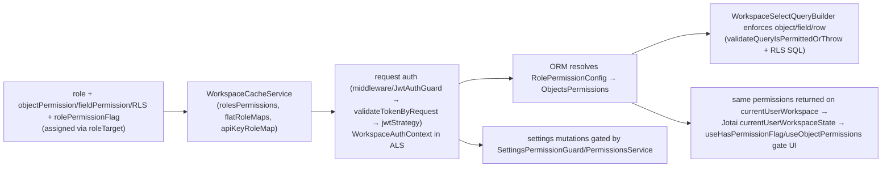

# 10 — Authentication & Authorization

Backend under `packages/twenty-server/src`, UI notes from `packages/twenty-front/src/modules/auth`.

## 1. Token types & JWT

`JwtTokenTypeEnum` (`engine/core-modules/auth/types/jwt-token-type.enum.ts`): ACCESS, REFRESH, WORKSPACE_AGNOSTIC, LOGIN, FILE, FILE_UPLOAD, API_KEY, REMOTE_SERVER, APPLICATION_ACCESS, APPLICATION_REFRESH, APP_OAUTH_STATE, APPROVED_ACCESS_DOMAIN, PLAYGROUND.

Token services (`auth/token/services/`):
- **Access** (`access-token.service.ts`): short-lived, workspace-scoped. Payload `{userId, workspaceId, workspaceMemberId, userWorkspaceId, type:ACCESS, authProvider, isImpersonating}`.
- **Refresh** (`refresh-token.service.ts`): persisted as `AppTokenEntity` (`type:REFRESH_TOKEN`), JWT `jti = appToken.id`; `REFRESH_TOKEN_REUSE_GRACE_PERIOD` allows concurrent-tab races.
- **Login** (`login-token.service.ts`): `sub = email`, bridges the redirect after credential/SSO validation to token exchange (`/verify`).
- **Workspace-agnostic** (`workspace-agnostic-token.service.ts`): only `userId + authProvider`, no workspace — issued at sign-in before workspace selection.
- Others: `sso-exchange-token`, `transient-token`, `email-verification-token`, `renew-token`, `application-token`.

`AppTokenEntity` (`core.appToken`) stores refresh tokens + `AUTHORIZATION_CODE`, `PASSWORD_RESET_TOKEN`, `INVITATION_TOKEN`, `EMAIL_VERIFICATION_TOKEN`, `SSO_EXCHANGE_TOKEN`, PKCE challenges. JWT signing in `engine/core-modules/jwt/` (`JwtWrapperService`, `JwtKeyManagerService` + `SigningKeyEntity` + rotation cron for asymmetric keys).

**JWT Passport strategy** `auth/strategies/jwt.auth.strategy.ts` — `validate(payload)` dispatches by `payload.type`: API_KEY → `validateAPIKey` (from cached `apiKeyMap` by `jti`), ACCESS/PLAYGROUND → `validateAccessToken` (loads user + userWorkspace, asserts `userWorkspace.workspaceId === workspace.id`, loads member from `flatWorkspaceMemberMaps`; validates impersonation), WORKSPACE_AGNOSTIC → just `{user, authProvider}`, APPLICATION_ACCESS → application context. Returns `AuthContext`.

## 2. Per-request authentication

Two entry paths, both funnel to `AccessTokenService.validateTokenByRequest`:
1. **Main GraphQL** — middleware `GraphQLHydrateRequestFromTokenMiddleware` → `MiddlewareService.hydrateGraphqlRequest` → validate → `bindDataToRequestObject`.
2. **REST/metadata/MCP** — `JwtAuthGuard` (`engine/guards/jwt-auth.guard.ts`) does the same; returns false unless `apiKey | userWorkspaceId | application` present.

`validateTokenByRequest`: extracts Bearer JWT; **rejects user-session tokens as Bearer** (session tokens are cookie-only, anti-XSS). No Bearer → `UserSessionCookieService` → `resolveSession` → `jwtStrategy.validate` (cookie-session path, `engine/core-modules/user-session`). After auth, `WorkspaceAuthContextMiddleware` builds `WorkspaceAuthContext` and stores it in ALS via `withWorkspaceAuthContext` (feeds ORM permission resolution).

**Guards** (`engine/guards/`): `WorkspaceAuthGuard` (requires `req.workspace`), `UserAuthGuard`/`RequireAccessTokenGuard`, `PublicEndpointGuard` (unauthenticated marker), `NoPermissionGuard`, `SettingsPermissionGuard(flag)` (→ `PermissionsService.userHasWorkspaceSettingPermission`), impersonation guards, `FeatureFlagGuard`.

## 3. Login / signup

Resolver `auth/auth.resolver.ts`, orchestration `services/auth.service.ts` + `sign-in-up.service.ts`:
- **Password sign-in** → `validateLoginWithPassword` (provider enabled/SSO bypass, invitation/access, `compareHash`, email-verified) → **login token** → client exchanges for access + refresh.
- **Workspace-agnostic `signIn`** → returns `availableWorkspaces` + workspace-agnostic token + refresh + cookie session.
- **Sign-up**: `signUp` (verification email), `signUpInWorkspace`, `signUpInNewWorkspace`.
- **Email verification**, **password reset** (`updatePassword` revokes all refresh tokens + sessions), **token renewal** (`renewToken`), **impersonation** (event-logged).

## 4. OAuth / SSO

Strategies (`auth/strategies/`): Google (`google.auth.strategy.ts` + `GoogleAPIsService` for Gmail/Calendar scopes), Microsoft (`microsoft.auth.strategy.ts` + `MicrosoftAPIsService`), **OIDC** (`oidc.auth.strategy.ts`), **SAML** (`saml.auth.strategy.ts`). Social sign-in unifies through `signInUpWithSocialSSO`. SSO module (Enterprise): `WorkspaceSSOIdentityProviderEntity` (`core.workspaceSSOIdentityProvider`, per-workspace IdP, OIDC clientID/secret or SAML ssoURL/certificate). Provider bypass toggles per workspace (`isPasswordAuthBypassEnabled`, etc.), per-user via `SSO_BYPASS` flag.

## 5. 2FA & API keys

- **2FA**: TOTP only (`two-factor-authentication/strategies/otp/totp/`). `TwoFactorAuthenticationMethodEntity` keyed to `userWorkspaceId`, encrypted `secret` (`enc:v2:` CHECK). Enforced during login-token exchange.
- **API keys**: `ApiKeyEntity` (`core.apiKey`) — the secret is a JWT (`{sub: workspaceId, type: API_KEY}`, `jwtid = apiKeyId`), not stored; validated against cached `apiKeyMap`. Generation guarded by `SettingsPermissionGuard(API_KEYS_AND_WEBHOOKS)`. Role via `RoleTargetEntity` (`apiKeyId`, role must have `canBeAssignedToApiKeys`).

## 6. Workspace membership

- `UserEntity` (`core.user`) global; `UserWorkspaceEntity` (`core.userWorkspace`) join (unique `userId+workspaceId`), holds `locale`, GraphQL-exposed `permissionFlags`/`objectsPermissions`/`isImpersonating`.
- A user belongs to multiple workspaces via multiple userWorkspace rows. `addUserToWorkspaceIfUserNotInWorkspace` creates userWorkspace + workspace-member record + assigns role. **Workspace switching**: no in-place switch — each workspace is a subdomain/domain; the flow is workspace-agnostic token → list workspaces → login token for the chosen workspace → redirect to that URL → exchange for workspace access/refresh token.
- Auto-join: `ApprovedAccessDomainEntity` (email-domain), public invite links, personal invitations.

## 7. RBAC model (metadata-modules)

- **`RoleEntity`** (`metadata-modules/role/role.entity.ts`, table `role`, unique `label+workspaceId`): grant-all flags `canUpdateAllSettings`, `canAccessAllTools`, `canReadAllObjectRecords`, `canUpdateAllObjectRecords`, `canSoftDeleteAllObjectRecords`, `canDestroyAllObjectRecords`; assignability `canBeAssignedToUsers/Agents/ApiKeys`; relations `objectPermissions`, `rolePermissionFlags`, `fieldPermissions`, `rowLevelPermissionPredicates`, `roleTargets`. Extends `SyncableEntity`.
- **Permission flags** (`twenty-shared/src/constants/PermissionFlagType.ts`): settings — API_KEYS_AND_WEBHOOKS, WORKSPACE, WORKSPACE_MEMBERS, ROLES, DATA_MODEL, SECURITY, WORKFLOWS, IMPERSONATE, SSO_BYPASS, APPLICATIONS, MARKETPLACE_APPS, LAYOUTS, BILLING, AI_SETTINGS; tool — AI, VIEWS, UPLOAD_FILE, DOWNLOAD_FILE, SEND_EMAIL_TOOL, CREATE_CALENDAR_EVENT_TOOL, HTTP_REQUEST_TOOL, CODE_INTERPRETER_TOOL, IMPORT_CSV, EXPORT_CSV, CONNECTED_ACCOUNTS, PROFILE_INFORMATION. Attached via `RolePermissionFlagEntity`.
- **Object-level** `ObjectPermissionEntity` (unique `objectMetadataId+roleId`): nullable `canRead/Update/SoftDelete/DestroyObjectRecords` (null = inherit role grant-all).
- **Field-level** `FieldPermissionEntity` (unique `fieldMetadataId+roleId`): `canReadFieldValue`/`canUpdateFieldValue` (only *restrict*).
- **Row-level** (Enterprise) `RowLevelPermissionPredicateEntity` (`core.rowLevelPermissionPredicate`): per role+object+field, `operand` (default CONTAINS), jsonb `value`, optional compare against the current workspace member's field; grouped via `RowLevelPermissionPredicateGroupEntity`.
- **Assignment** `RoleTargetEntity` (`roleTarget`): a role to exactly one of `userWorkspaceId | agentId | apiKeyId` (DB CHECK).
- **`PermissionsService`** (`permissions/permissions.service.ts`): `getUserWorkspacePermissions` → `{permissionFlags, objectsPermissions}` (each flag = grant-all OR `roleHasPermissionFlag`); `userHasWorkspaceSettingPermission` (intersects user-role with app's default role when both apply); `checkRolesPermissions` uses **intersection** for multi-role. Caches: `rolesPermissions`, `flatRoleMaps`, `apiKeyRoleMap`, `flatWorkspaceMemberMaps` in `WorkspaceCacheService`.

## 8. Enforcement at query time (twenty-orm)

Enforcement is in the ORM query builders, NOT resolvers. `WorkspaceRepository` is constructed with `objectRecordsPermissions`, `shouldBypassPermissionChecks`, `authContext` (from the ALS auth context via `resolve-role-permission-config.util.ts`: system context → bypass; else `{intersectionOf: roleIds}`).
- **Object + field** `permissions.utils.ts::validateQueryIsPermittedOrThrow` (called from each builder's `validatePermissions()`): select→`canRead`, insert/update→`canUpdate`, delete→`canDestroy`, restore/soft-delete→`canSoftDelete`; `validateReadFieldPermissionOrThrow` rejects `SELECT *` when any field `canRead===false`, else checks each column; `validateUpdateFieldPermissionOrThrow` blocks restricted writes. (System objects except `workspaceMember` bypass field checks.)
- **Row-level** `workspace-select-query-builder.ts` injects SQL WHERE/JOIN predicates from the role's RLS predicates before validation.
- **Settings/metadata** gated at the resolver by `SettingsPermissionGuard(flag)`.

## 9. Flow to the frontend

Effective permissions ride on `currentUserWorkspace` of the main user query (`front/src/modules/users/graphql/fragments/userQueryFragment.ts`: `permissionFlags`, `isImpersonating`, `objectsPermissions`). Stored in Jotai `currentUserWorkspaceState`. Gating: `useHasPermissionFlag(PermissionFlagType)` (settings/nav), `useObjectPermissions` → `objectPermissionsByObjectMetadataId` (read-only fields, disabled actions), field-level via `isFieldMetadataReadOnlyByPermissions`. Token attach in `apollo.factory.ts` `authLink`; `UNAUTHENTICATED` → shared `renewToken` with backoff.

## 10. End-to-end permission flow

**Anchor files:** `auth/token/services/access-token.service.ts`, `auth/strategies/jwt.auth.strategy.ts`, `engine/middlewares/graphql-hydrate-request-from-token.middleware.ts`, `engine/core-modules/auth/middlewares/workspace-auth-context.middleware.ts`, `metadata-modules/permissions/permissions.service.ts`, `engine/twenty-orm/repository/permissions.utils.ts`, front `auth/hooks/useAuth.ts` + `settings/roles/hooks/useHasPermissionFlag.ts`.
