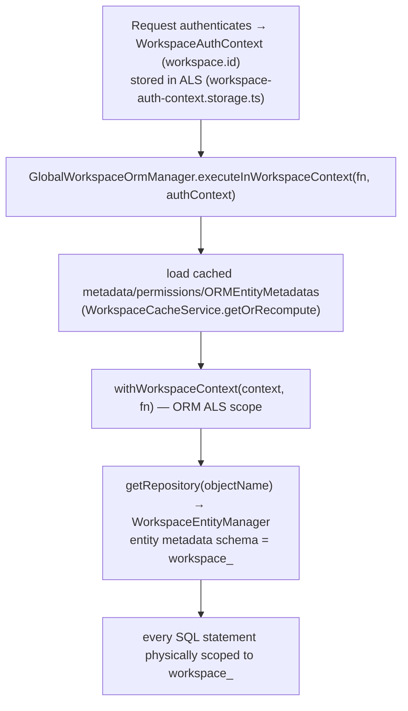

# 11 — Workspaces & Multi-Tenancy

Twenty is **schema-per-tenant**: each workspace gets its own PostgreSQL schema; core/system and metadata tables live in the shared `core` schema. See also [06-DATABASE-DATA-MODEL.md](06-DATABASE-DATA-MODEL.md).

## 1. How a workspace is identified per request

The workspaceId comes from the authenticated request, **never from user input in the query** — so the schema path cannot be spoofed.

## 2. Three isolation layers

1. **Physical schema separation (primary boundary)** — data lives in `workspace_<base36(uuid)>`; entity metadata's schema path is derived from the request's workspaceId, so cross-tenant reads are structurally impossible through the ORM.
2. **Row-level permissions (RLS)** within a workspace — `workspace-select-query-builder.ts` renders per-role predicates into SQL. Object/field permissions via `permissions.utils.ts`.
3. **WorkspaceScopedRepository** for core-schema shared tables that carry `workspaceId` (e.g. `RoleEntity`) — every query forced to include `workspace_id = ?`; entity-based delete/remove methods deliberately removed to prevent PK-only cross-tenant writes.

Additional hardening: `GlobalWorkspaceDataSource` refuses raw `createQueryBuilder`/`query` unless routed through the permission-checking entity manager or explicitly bypassed; DDL locked during hot upgrades (`WORKSPACE_SCHEMA_DDL_LOCKED`).

## 3. Workspace creation flow

Entry `engine/core-modules/workspace/services/workspace.service.ts` calls `workspaceManagerService.init({workspace, userId})` during activation (guarded by `activationStatus`: `PENDING_CREATION`/`ONGOING_CREATION` → `ACTIVE`).

`engine/workspace-manager/workspace-manager.service.ts::init()`:
1. `createWorkspaceDBSchema(workspaceId)` → `CREATE SCHEMA workspace_<id>` on core datasource.
2. `workspaceRepository.update(workspaceId, {databaseSchema: schemaName})`.
3. `applicationService.createTwentyStandardApplication({workspaceId})`.
4. `twentyStandardApplicationService.synchronizeTwentyStandardApplicationOrThrow({workspaceId})` — **seeds all standard objects**.
5. `setupDefaultRoles(...)` — assign standard admin role to the creator, ensure member role, set `workspace.defaultRoleId`.

Then `enableFeatureFlags(DEFAULT_FEATURE_FLAGS)`, `createWorkspaceMember`, `prefillCreatedWorkspaceRecords` (demo/seed records).

## 4. Standard-object seeding (replaces `@WorkspaceEntity`)

`engine/workspace-manager/twenty-standard-application/services/twenty-standard-application.service.ts::synchronizeTwentyStandardApplicationOrThrow`:
1. Read current ("from") flat entity maps for the standard application from cache.
2. Compute desired ("to") state via `computeTwentyStandardApplicationAllFlatEntityMaps` — the **static definition of all standard objects/fields**, assembled from builders like `.../utils/field-metadata/compute-company-standard-flat-field-metadata.util.ts` (each field via `createStandardFieldFlatMetadata`, including base id/createdAt/updatedAt/deletedAt + searchVector).
3. Build a from→to diff and run through `WorkspaceMigrationValidateBuildAndRunService` with `isSystemBuild:true`, `inferDeletionFromMissingEntities:true`.

That migration pipeline writes metadata rows into `core` AND executes physical DDL into the workspace schema (via `create-object-action-handler.service.ts` → `WorkspaceSchemaManagerService`). So the modern equivalent of "@WorkspaceEntity standard objects" is: **static flat-metadata builders → metadata diff → workspace-migration runner → metadata rows in `core` + physical tables in `workspace_<id>`.**

Standard-object modules: `company`, `person`, `opportunity`, `task`, `note`, `attachment`, `blocklist`, `call-recording`, `dashboard`, `emailing`, `timeline`, `workspace-member` (`src/modules/*/standard-objects/`).

## 5. Workspace-scoped config & caches

Beyond data, many things are per-workspace: metadata version, GraphQL SDL + resolver name map, feature flags (`core.featureFlag` unique `(key, workspaceId)`), roles/permissions maps, AI model availability, apiKey maps. Cached in `WorkspaceCacheStorageService` (Redis, TTL 1 week) keyed by workspaceId (+ metadataCacheHash where relevant), invalidated by the migration runner on metadata change.

## 6. Security boundaries summary

| Boundary | Mechanism |
|----------|-----------|
| Cross-tenant data | Schema-per-tenant; schema path derived from request workspaceId |
| Raw SQL escape | GlobalWorkspaceDataSource blocks `createQueryBuilder`/`query` outside the permission-aware manager |
| Core shared tables | `WorkspaceScopedRepository` mandatory `workspaceId` predicate; no PK-only mutations |
| Intra-workspace | Role/object/field permissions + RLS predicates rendered into SQL |
| Schema mutation during upgrade | `WORKSPACE_SCHEMA_DDL_LOCKED` |

## 7. Caveats / not fully confirmed

- Physically there is **no separate `metadata` schema** — metadata tables live in `core` (confirmed from entity decorators, not from a live DB enumeration).
- `uuidToBase36` lives in `twenty-shared/utils` (behavior inferred from name + fixtures like `workspace_adhj7eaegq93fzpgbfpdm8ok3`).

**Anchor files:** `engine/workspace-manager/workspace-manager.service.ts`, `engine/core-modules/workspace/services/workspace.service.ts`, `engine/workspace-manager/twenty-standard-application/services/twenty-standard-application.service.ts`, `engine/workspace-datasource/workspace-datasource.service.ts` + `utils/get-workspace-schema-name.util.ts`, `engine/twenty-orm/global-workspace-datasource/global-workspace-orm.manager.ts`.
