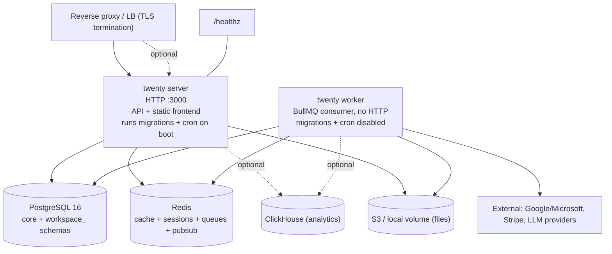

# 17 — Deployment & Self-Hosting

All under `packages/twenty-docker/`. Node `^24.5.0`, Yarn 4.

## Images (`twenty/Dockerfile`, multistage)

Base `node:24.18.0-alpine3.23`. Build stages: `front-deps`, `server-deps` (via `yarn workspaces focus`), `twenty-server-build` (`nx run twenty-server:lingui:extract/compile`, `twenty-emails:lingui:*`, `nx run twenty-server:build`; prunes `.d.ts`/tests), `twenty-front-build` (lingui + `nx build twenty-front`, `NODE_OPTIONS=--max-old-space-size=8192`). Runtime targets:
- `twenty-server` — server only, `CMD ["node","dist/main"]`, `ENTRYPOINT ["/app/entrypoint.sh"]`, UID 1000, `NODE_ENV=production`.
- `twenty-server-aws` / `twenty-aws` — add `aws-cli`.
- `twenty` — server + frontend static build in `dist/front`.
- `twenty-app-dev` — all-in-one (bundles Postgres 18 + Redis via s6-overlay), for local/SDK use; insecure default `APP_SECRET`, port 2020, migrations/cron disabled.

## Compose (`docker-compose.yml`)

Services:
- **server** (`twentycrm/twenty:${TAG}`, port 3000, healthcheck `curl --fail http://localhost:3000/healthz`, depends on healthy db+redis, mounts `server-local-data`).
- **worker** (same image, `command: ["yarn","worker:prod"]`, `DISABLE_DB_MIGRATIONS=true` + `DISABLE_CRON_JOBS_REGISTRATION=true` — server owns those, depends on healthy server).
- **db** (`postgres:16`, `db-data` volume, `pg_isready`).
- **redis** (`--maxmemory-policy noeviction`).

**No reverse proxy is bundled** — `SERVER_URL`/`FRONTEND_URL` assume an external proxy/LB; keep `SERVER_KEEP_ALIVE_TIMEOUT_MS` above proxy idle timeout. `docker-compose.dev.yml` is infra-only (Postgres 16 + Redis 7 with published ports) for source-based dev.

## Migrations at startup (`twenty/entrypoint.sh`)

On server container start (skipped if `DISABLE_DB_MIGRATIONS=true`): check whether `core` schema exists; if empty → `yarn database:init:prod`; then `yarn command:prod cache:flush` → `yarn command:prod upgrade` (runs registered instance/workspace upgrade commands) → `cache:flush`; then `cron:register:all` (skipped if cron disabled). Failures log warnings but don't block startup. The **worker skips both** migrations and cron registration.

## Health

`core-modules/health/controllers/health.controller.ts` mounts `/healthz` (Terminus, `@HealthCheck()`, guarded `PublicEndpointGuard` + `NoPermissionGuard`) — the Docker/k8s liveness probe.

## Kubernetes / Helm

- `k8s/manifests/`: Deployments for server/worker/db/redis + `ingress.yaml` + PVs. `k8s/terraform/`.
- `helm/twenty/`: `Chart.yaml`, `values.yaml`, `values.schema.json`, templates for server/worker/db-internal/redis-internal + ingress + PVCs + secrets (`secret-tokens`, `secret-db-url`). Defaults: image `twentycrm/twenty`, securityContext uid/gid 1000, storage `local|s3`, server `replicaCount:1`, tokens secret auto-generated. Extensive `helm/twenty/tests/`.

## Runtime topology

**Minimum viable self-host**: server + worker + Postgres + Redis + a reverse proxy for TLS, with `APP_SECRET`, `PG_DATABASE_URL`, `REDIS_URL`, `SERVER_URL`/`FRONTEND_URL` set. S3 optional (local volume works). ClickHouse optional (analytics only).

**Anchor files:** `packages/twenty-docker/twenty/{Dockerfile,entrypoint.sh}`, `docker-compose.yml`, `docker-compose.dev.yml`, `helm/twenty/values.yaml`, `k8s/manifests/`, `packages/twenty-server/src/engine/core-modules/health/controllers/health.controller.ts`.
