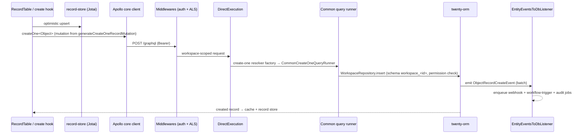
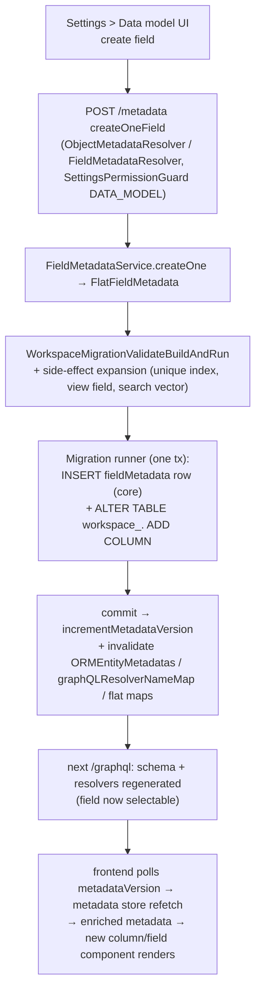
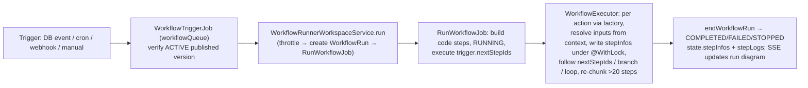
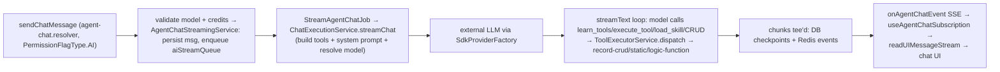
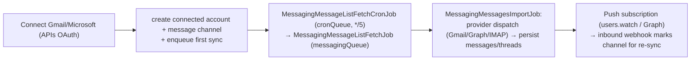
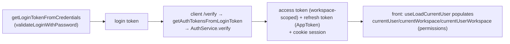

# 22 — Feature Flows

Real end-to-end traces through the stack. Server paths under `packages/twenty-server/src`, front under `packages/twenty-front/src`.

## A. Creating a CRM record

Front files: `object-record/hooks/useCreateOneRecord.ts` → `generateCreateOneRecordMutation` (`object-metadata/utils/`). Server: create-one resolver factory → `common-query-runners` → `twenty-orm`. Writes emit events → `entity-events-to-db.listener.ts` → jobs.

## B. Creating a custom field (metadata → schema → API → UI)

Key files: `metadata-modules/field-metadata/`, `metadata-modules/metadata-side-effect/`, `workspace-manager/workspace-migration/` (see [07](07-METADATA-ENGINE.md)), front `object-metadata/states/objectMetadataItemsWithFieldsSelector.ts` + `useColumnDefinitionsFromObjectMetadata.ts`.

## C. Running a workflow

DB-event path: a record write (flow A) → `entity-events-to-db.listener.ts` enqueues `CallDatabaseEventTriggerJobsJob` on `triggerQueue`, and `workflow-database-event-trigger.listener.ts` matches watched fields + record filter → `WorkflowTriggerJob`. Full detail in [08](08-WORKFLOWS.md).

## D. AI chat interaction

CRUD tools execute under the acting role's `RolePermissionConfig` (same enforcement as flow A). Full detail in [09](09-AI-SYSTEM.md).

## E. Email sync (background)

Requires the worker. Full detail in [14](14-INTEGRATIONS.md) + [15](15-BACKGROUND-JOBS.md).

## F. Login (password) → workspace access

2FA (if enabled) inserts an OTP step before token exchange. SSO/OAuth follows `signInUpWithSocialSSO`. Full detail in [10](10-AUTH-PERMISSIONS.md).
