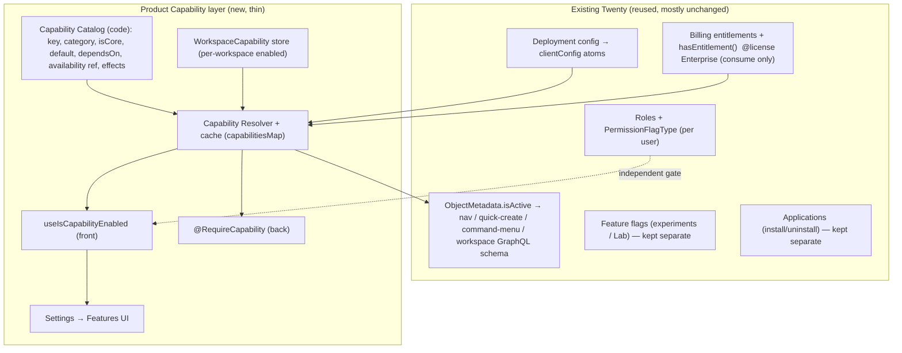

# 02 — Architecture

The final capability/module architecture. Decision rationale in [IMPLEMENTATION-PLAN.md](IMPLEMENTATION-PLAN.md) §"Architecture decision".

## Principle: one thin coordinating layer that consumes existing systems

Twenty already has the building blocks ([01](01-EXISTING-TWENTY-FEATURE-SYSTEMS.md)). We add **one** small layer — the **Product Capability layer** — and reuse everything else. No parallel feature system, no microservices, no changes to Enterprise-licensed billing.

## The three questions → three gates

A feature is usable iff **all three** pass:

1. **Available?** (commercial + deployment) — existing: `hasEntitlement(entitlementKey?)` (or true when billing off) AND `clientConfig[configFlag?]`. Blank in catalog = always available.
2. **Enabled?** (workspace product config) — new: `WorkspaceCapability.isEnabled` for the capability (and its dependency chain).
3. **Authorized?** (user) — existing: `PermissionFlagType` / object permissions.

`isCapabilityUsable = available && enabled && authorized`. The layer owns only #2; it *reads* #1 and never touches #3.

## How enable/disable takes effect (reuse, don't rebuild)

- **Object-backed capabilities** (Dashboards, future Products/Reports, custom objects): the resolver toggles `ObjectMetadata.isActive` for the capability's standard object(s). This already propagates to nav, quick-create, command menu, and — critically — inactive objects are excluded from the workspace GraphQL schema, giving **backend enforcement for free** and **data preservation for free** (rows are not dropped). *(Assumption to verify before build — see Risks.)*
- **Non-object capabilities** (Email, Calendar, Automations, AI): no single object to toggle. The resolver drives (a) a frontend hook used in settings-nav `isHidden`, route wrappers, and the command-menu filter pipeline; and (b) a backend `@RequireCapability` guard on the relevant resolvers/jobs.

## Storage (follow the `enabledAiModelIds` precedent)

- **Catalog** = code constant (backend, plus a shared enum in `twenty-shared`). Source of truth (§13).
- **Per-workspace enabled state** = `WorkspaceCapabilityEntity` (`core.workspaceCapability`, unique `(key, workspaceId)`, `isEnabled boolean`) — same shape as `FeatureFlagEntity`, semantically separate. (Alternative: `workspace.enabledCapabilities: string[]` mirroring `enabledAiModelIds`; see [05](05-WORKSPACE-CONFIGURATION.md).)
- **Cache** = `capabilitiesMap` in the workspace cache (mirrors `featureFlagsMap`), and `currentWorkspace.enabledCapabilities` for a single frontend fetch.

## Why not the alternatives (short)
- Not billing (Enterprise-licensed, commercial, 4 keys). Not apps (no soft disable; uninstall destroys data). Not feature-flags-repurposed (experiment semantics, no catalog/deps). Full comparison in [IMPLEMENTATION-PLAN.md](IMPLEMENTATION-PLAN.md) Alternatives + [06](06-FEATURE-FLAGS.md)/[07](07-APPS-AND-MODULES.md).

## Layered responsibilities (never mix)
- **Deployment feature** = `clientConfig` `IS_*` (instance).
- **Commercial entitlement** = `BillingEntitlementKey` (workspace, commercial, Enterprise).
- **Workspace product capability** = the new layer (workspace, product config).
- **Installed app** = `ApplicationEntity` (workspace, packaging).
- **User permission** = `PermissionFlagType`/roles (user).
- **Experiment/Lab** = `FeatureFlagKey` (workspace, temporary).

## Risks (verify before implementation)
1. **`isActive` = schema exclusion + lossless reactivation** — the whole object-backed design leans on this. Must confirm: (a) deactivating a standard object removes it from the workspace GraphQL schema (enforcement), (b) its table/rows are retained (data preservation), (c) reactivation is lossless and doesn't re-run destructive migration. If any is false, object-backed capabilities fall back to guard-based gating like non-object ones.
2. **Metadata-version churn:** toggling `isActive` bumps the workspace metadata version and regenerates schema/caches — heavier than a boolean flag. Acceptable for an admin action; document.
3. **Enterprise/billing asymmetry** (backend `hasEntitlement` grants on self-hosted while frontend entitlement list requires an enterprise token) already exists in Twenty; the availability resolver must pick one consistent rule (recommend: mirror `hasEntitlement`'s self-hosted-true behavior for availability).
4. **Dependency cycles / cascade** — catalog validated at load; resolver rejects cycles.

## Differences from the prompt's examples (§28 required)

| Prompt example | Our design | Why |
|---|---|---|
| Illustrative modules incl. **Leads, Products, Reports** | Leads dropped (recommend pipeline-stage instead); Products/Reports catalog-ready but **not built** (no objects exist today) | Can't migrate non-existent features; over-scoping would be fiction |
| `enabledModules: string[]` as the store | `WorkspaceCapabilityEntity` rows (or `enabledCapabilities[]` mirroring `enabledAiModelIds`) | Follow an existing Twenty precedent; per-capability rows allow audit + partial availability |
| A standalone module **registry/registry framework** | A **code catalog** that maps to **existing** `isActive` + guards | Avoid a parallel system; reuse metadata-driven nav/actions |
| Modules inherently mapped to pricing plans | Capabilities are pricing-independent; availability *optionally* references an entitlement | §6 — module system must not depend on billing |
| One "capability" per tiny feature (DealNotesModule…) | Capabilities = human-meaningful product areas only | §12 avoid over-modularization |
| Route hiding is enough | Object-backed → schema exclusion; non-object → guard + route wrapper | §18 UI hiding ≠ security |
| Build new nav/command-menu gating | Reuse `useFilteredObjectMetadataItems` + add one predicate to existing pipelines | Minimal upstream change |
| Generic "apps == modules" | Apps stay separate; core capabilities are not installable apps | §9 — apps lack soft-disable |

The rest of the docs (03–17) detail each concern.
