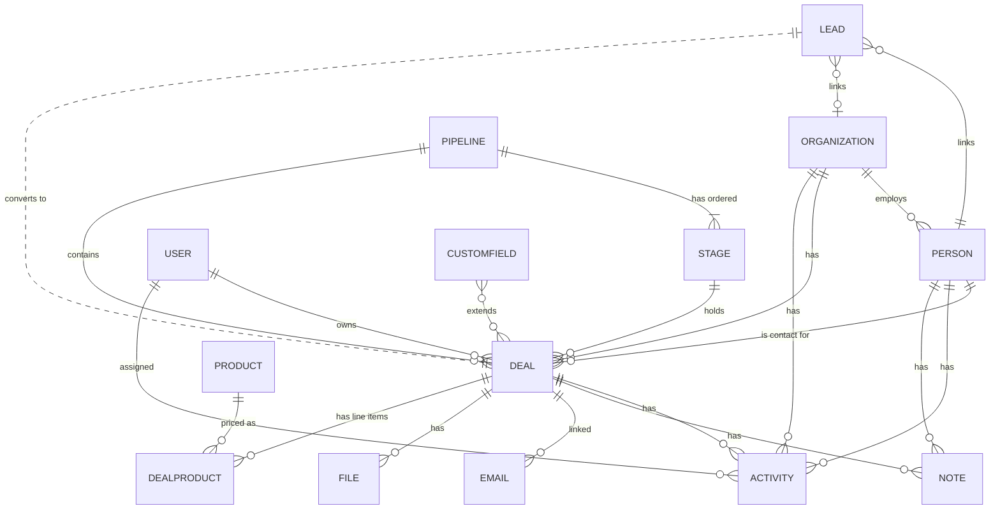

# 01 — Pipedrive as a Product

Method: mix of **OBSERVED** (live read-only walk of an authenticated account `komdis.pipedrive.com`, German UI), **DOCUMENTED** (Pipedrive help/marketing), **INFERRED** (analysis). German labels are translated inline.

## What Pipedrive actually is

Pipedrive is a **deal-centric, activity-based sales CRM**. Its whole design orbits one loop: *put deals on a visual pipeline, and never leave a deal without a scheduled next activity.* Everything else (contacts, email, reports, automation) exists to serve that loop. It is deliberately a **sales pipeline tool**, not a full customer-lifecycle platform — a strength (simple, learnable) and its main structural limit (weak post-sale).

## Primary navigation (OBSERVED, left icon rail)

| Area | German label | Purpose |
|------|--------------|---------|
| Setup guide | Setup-Guide | Onboarding checklist + usage nudges (home) |
| Contacts | Kontakte | People + Organizations + contacts timeline + duplicate merge |
| Activities | Aktivitäten | Tasks/calls/meetings list + calendar; "what to do next" |
| Deals | Deals | Pipeline (Kanban) / List / Forecast views |
| Leads | Leads | Lead Inbox + LeadBooster (chatbot/livechat/webforms/prospector) |
| Insights | Einblicke | Dashboards, reports, goals |
| Mail | Sales-Posteingang | Email sync inbox, drafts/sent/archive |
| More (…) | | Products, Projects/Campaigns add-ons, etc. |

Top bar: global search ("Pipedrive durchsuchen"), quick-add (+), an AI assistant orb, marketplace, help, notifications, account.

## Product areas (OBSERVED unless noted)

- **Home / Setup guide** — onboarding checklist with a "usage level" meter and task cards (review sales performance, invite team, connect email/calendar). Not a metrics dashboard (that's Insights).
- **Deals / Pipeline** — the core. See [02-DEALS-PIPELINE.md](02-DEALS-PIPELINE.md).
- **Contacts** — People + Organizations, with inline duplicate detection/merge. See [03-CONTACTS-LEADS.md](03-CONTACTS-LEADS.md).
- **Activities** — typed tasks (call/meeting/task/deadline/lunch + custom), time buckets (To-Do/Overdue/Today/Tomorrow/This week), deal/contact linked. See [04-ACTIVITIES.md](04-ACTIVITIES.md).
- **Leads** — a separate pre-deal inbox. See [03-CONTACTS-LEADS.md](03-CONTACTS-LEADS.md) §Leads.
- **Mail** — 2-way email sync (Growth plan), templates, tracking, team inbox + AI (Premium). See [05-EMAIL-CALENDAR.md](05-EMAIL-CALENDAR.md).
- **Products** — a product catalog; line items attach to deals with price/qty (empty in this account).
- **Insights** — dashboards, reports (capped, e.g. "0/50"), goals, AI-generated reports. See [08-REPORTING.md](08-REPORTING.md).
- **Automations** — trigger→condition→action workflows (DOCUMENTED; the builder was not reachable in this account — likely plan-gated on Lite/absent; a "Open automations" banner confirms the feature exists). See [07-AUTOMATIONS.md](07-AUTOMATIONS.md).
- **Settings** — Data fields (custom fields per entity), Users & access (permission sets + visibility groups), Company settings (activity types, currencies, lost reasons, labels), billing, security center, marketplace, **Pipedrive MCP (BETA)**, devices, import.
- **Add-ons** — LeadBooster, Web Visitors, Campaigns (email marketing), Smart Docs (e-sign), Projects (post-sale). Billed separately (see [10-PRICING.md](10-PRICING.md)).

## Unified record-detail template (OBSERVED — important pattern)

Deal, Organization and Person detail pages share one layout:
- **Header**: record title, owner, follower(s), primary CTA (+Deal / Won+Lost for deals), view toggle, "…" menu.
- **Left sidebar**: Summary → Details (typed fields) → linked records (Contact/Org, Deals rollup with mini-pipeline + rotting icon) → inline **duplicates** ("2 duplicates found — view & merge").
- **Main column**: action tabs (Activity, Notes, Meeting scheduler, Call, WhatsApp, Email, Files, Documents, Invoice) → **Focus** (planned activities, pinned notes, email drafts) → **History/timeline** filterable by type (Activities, Notes, Emails, Files, Documents, Changelog).

This template consistency is a big usability win: learn one record page, you know them all.

## Conceptual data model

Key relationships (OBSERVED/DOCUMENTED):
- **Lead → Deal**: a Lead is a pre-qualification holding record; converting it creates a Deal (one-way). Leads live in a separate inbox, not on the pipeline.
- **Person ↔ Organization**: a Person optionally belongs to one Organization; an Org has many People. Both roll up deal counts.
- **Person/Organization → Deal**: a Deal links to one contact Person and (usually) one Organization.
- **Deal → Pipeline → Stage**: a Deal sits in exactly one Stage of one Pipeline; multiple pipelines supported ("All Pipelines" view).
- **Deal → Activities/Emails/Notes/Files/Products**: all hang off the deal and appear in its timeline; Products are catalog items attached as priced line items.
- **Custom fields** extend Lead/Deal, Person, Organization, Product independently.

## Why it works (INFERRED)

1. **One mental model** — "deals move left→right toward a sale" needs no training.
2. **Activity-based selling** — the product constantly asks "what's the next action?" (e.g. auto-popup to plan a follow-up when a deal is won), reducing CRM to a to-do list bolted to deals.
3. **Template consistency** — every record page is the same shape.
4. **Progressive disclosure** — custom fields, automation, forecasting exist but are out of the way until needed.

## Where it strains (INFERRED, corroborated by complaints — [11](11-USER-COMPLAINTS.md))

Deal-centric (weak post-sale/customer lifecycle); core capabilities (email sync, automation, reporting depth) gated behind higher tiers/add-ons; reporting shallow at the bottom; automation capped. These are the openings for a competitor ([16](16-COMPETITIVE-OPPORTUNITIES.md)).
